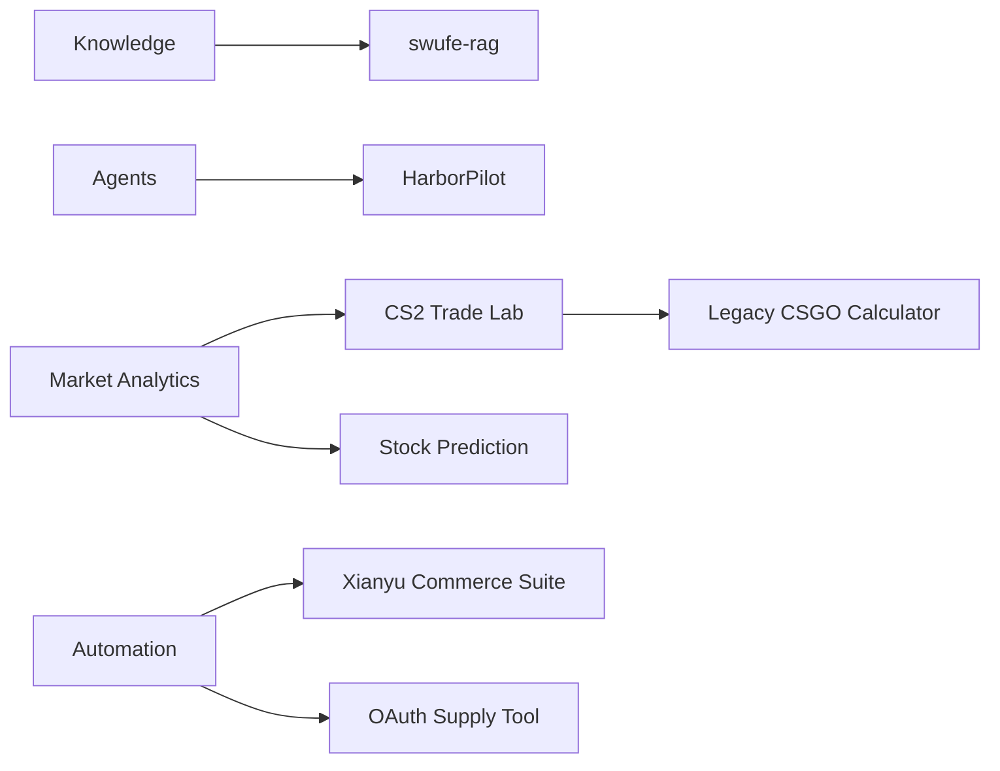

# Hi, I'm ZorIgn 👋

**构建能落地、可验证、可审计的 AI 与自动化系统。**

从教务知识 RAG、多智能体申请辅助，到市场分析、库存履约和工程自动化。

## 🚀 Flagship systems

| Repository | Role | Purpose |
| --- | --- | --- |
| [`swufe-rag`](https://github.com/ZorIgn/swufe-rag) | **VERIFY** | SQL + RAG 教务知识系统，让课程、学分和制度答案回到原文件与页码 |
| [`HarborPilot-MultiAgent`](https://github.com/ZorIgn/HarborPilot-MultiAgent) | **AGENT** | 港新硕士申请辅助平台，强调字段级来源、人工审核和可信度门禁 |
| [`CS2_trade`](https://github.com/ZorIgn/CS2_trade) | **ANALYZE** | CS2 炼金概率、实时行情、T+7 预测、EV 与尾部风险分析 |
| [`xianyu-codex-commerce-suite`](https://github.com/ZorIgn/xianyu-codex-commerce-suite) | **FULFILL** | 闲鱼消息、订单、库存出库、自动发货与激活审计的一体化工程 |

## 🧭 Project map

## 🧩 Module registry

<strong>AI & Knowledge Systems</strong>

| Module | Purpose |
| --- | --- |
| [`swufe-rag`](https://github.com/ZorIgn/swufe-rag) | 可验证的教务问答、学业审计与原文引用 |
| [`HarborPilot-MultiAgent`](https://github.com/ZorIgn/HarborPilot-MultiAgent) | 可信多智能体申请规划、来源采集与文书工作台 |

<strong>Analytics & Research</strong>

| Module | Purpose |
| --- | --- |
| [`CS2_trade`](https://github.com/ZorIgn/CS2_trade) | CS2 炼金规则、市场行情、价格预测与风险引擎 |
| [`prediction`](https://github.com/ZorIgn/prediction) | LSTM / GRU / SVR / ARIMA 股票预测与融合实验 |
| [`csgo_trade_up_contract_calculator`](https://github.com/ZorIgn/csgo_trade_up_contract_calculator) | 2019 年离线炼金枚举与 EV 计算历史项目 |

<strong>Automation & Commerce</strong>

| Module | Purpose |
| --- | --- |
| [`xianyu-codex-commerce-suite`](https://github.com/ZorIgn/xianyu-codex-commerce-suite) | 消息、订单、库存、自动发货与激活状态机 |
| [`codex-oauth-auto-register`](https://github.com/ZorIgn/codex-oauth-auto-register) | 账号导入/注册、OAuth 验证、接码轮询与 CPA 导出 |

## 🛠️ Tech focus

## 📊 GitHub snapshot

---

**Build it. Verify it. Make it useful.**

[Repositories](https://github.com/ZorIgn?tab=repositories) · [GitHub](https://github.com/ZorIgn)

